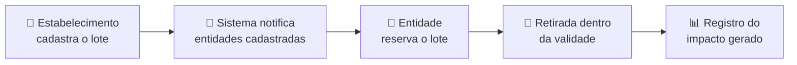

<div align="center">

# 🍲 RGEats

### Plataforma web para gestão, rastreabilidade e redução do desperdício alimentar em Rio Grande da Serra

*Conectando quem tem alimento sobrando a quem precisa dele, dentro do prazo de validade.*

<br>


<br>

[Visão geral](#-visão-geral) •
[Problema](#-o-problema) •
[Solução](#-a-solução) •
[Como funciona](#-como-funciona) •
[Metodologia](#-metodologia) •
[Tecnologias](#-tecnologias) •
[Roadmap](#-roadmap) •
[Como executar](#-como-executar-localmente) •
[Equipe](#-equipe)

</div>

---

## 📖 Visão geral

O **RGEats** é o Trabalho de Conclusão de Curso (TCC) do curso **Técnico em Informática para a Internet** da **ETEC de Rio Grande da Serra**.

O projeto aplica desenvolvimento web, engenharia de requisitos e modelagem de banco de dados para enfrentar um problema real do município: **alimentos próprios para consumo são descartados enquanto há famílias em insegurança alimentar**, principalmente por falta de logística e de comunicação entre quem doa e quem recebe.

<!-- TODO: adicionar print da tela inicial ou do protótipo do Figma -->
<!--
<div align="center">
  
</div>
-->

### 🌐 Alinhamento com a Agenda 2030 (ONU)

| ODS | Como o projeto contribui |
|:---:|---|
| **ODS 2**<br>Fome Zero e Agricultura Sustentável | Reaproveitamento seguro de alimentos para apoiar pessoas em vulnerabilidade alimentar. |
| **ODS 12**<br>Consumo e Produção Responsáveis | Economia circular e redução do descarte precoce de hortifrutis e perecíveis. |

---

## 🔍 O problema

Rio Grande da Serra tem desigualdades marcantes: parte da população convive com insegurança alimentar moderada a grave, enquanto comércios, feiras livres e hortifrutis descartam diariamente alimentos ainda adequados ao consumo.

| # | Gargalo | Consequência |
|:-:|---|---|
| 1 | **Ineficiência logística** | Não existe um canal rápido que conecte doadores e entidades dentro da janela de validade. |
| 2 | **Invisibilidade dos dados** | Não há mapeamento de onde o desperdício se concentra nem de onde a demanda é mais urgente. |
| 3 | **Escassez de recursos** | Instituições assistenciais têm orçamento limitado e dificilmente buscam doações de forma ativa. |

---

## 💡 A solução

Um **ecossistema web simples e intuitivo** que funciona como ponte entre quem gera excedentes e as entidades que apoiam a comunidade.

| 🗺️ Mapeamento ativo | 🔔 Notificação ágil | 📊 Rastreabilidade |
|---|---|---|
| Cadastro de estabelecimentos parceiros e sinalização de lotes disponíveis para resgate. | Entidades cadastradas são avisadas assim que um lote é disponibilizado. | Acompanhamento do volume reaproveitado e do impacto gerado na comunidade. |

---

## ⚙️ Como funciona



<!-- TODO: ajustar o fluxo acima conforme o que ficar definido no Draw.io (Fase 3) -->

---

## 🧪 Metodologia

A construção da plataforma parte de dados da realidade local, em três frentes:

1. **Ideação e Design Thinking**: brainstorming para delimitar o escopo e definir as personas do sistema.
2. **Coleta quantitativa**: questionário no *Google Forms* sobre perfil de consumo e percepção da comunidade sobre o desperdício.
3. **Mapeamento de campo**: levantamento dos pontos de circulação de alimentos (mercados, feirantes, escolas, associações de bairro) para identificar parceiros e validadores.

<!-- TODO: incluir aqui os principais resultados do questionário (nº de respostas, % relevantes) -->

---

## 🛠️ Tecnologias

<div align="center">


</div>

| Camada | Tecnologias | Responsabilidade |
|---|---|---|
| **Front-end** | HTML5, CSS3, JavaScript | Interfaces responsivas, com foco em usabilidade e acessibilidade. |
| **Back-end** | PHP | Regras de negócio, rotas e autenticação. |
| **Banco de dados** | MySQL | Modelagem relacional que garante a integridade dos dados de usuários, doações e cadastros. |
| **Versionamento** | Git e GitHub | Controle de versão e trabalho em equipe. |
| **Design e modelagem** | Figma, Draw.io | Wireframes, protótipos, fluxogramas e diagrama ER. |
| **Ambiente e edição** | XAMPP, VS Code, Brackets, FileZilla | Servidor local, edição de código e envio de arquivos. |
| **Apoio de IA** | Gemini, Claude, ChatGPT | Auxílio no desenvolvimento e na resolução de dúvidas técnicas. |

---

## 🗓️ Roadmap


| Fase | Etapa | Entregas | Status |
|:---:|---|---|:---:|
| **1** | Concepção e ideação | Brainstorming, delimitação do problema, levantamento de requisitos, estrutura do site no Figma, fluxogramas no Draw.io | ✅ Concluída |
| **2** | Pesquisa de campo e mapeamento | Coleta de dados com Google Forms e contato com atores locais | ✅ Concluída |
| **3** | Prototipagem e modelagem | Wireframes (Figma), DER (Draw.io) e fluxos de tela | 🔜 Próxima |
| **4** | Desenvolvimento e integração | Front-end, back-end PHP e banco MySQL, com apoio de IA | ⏳ Pendente |
| **5** | Testes, refinamento e defesa | Homologação, ajustes do Pré-TCC e apresentação final | ⏳ Pendente |

---

## 🚀 Como executar localmente

> ⚠️ Preencher e testar estes passos quando a Fase 4 estiver em andamento.

**Pré-requisitos:** [XAMPP](https://www.apachefriends.org/) (Apache + MySQL) e Git.

```bash
# 1. Clone o repositório dentro da pasta htdocs do XAMPP
git clone https://github.com/<usuario>/<repositorio>.git

# 2. Inicie o Apache e o MySQL pelo painel do XAMPP

# 3. Importe o banco de dados (phpMyAdmin > Importar)
#    arquivo: database/rgeats.sql   <!-- TODO: confirmar caminho -->

# 4. Acesse no navegador
#    http://localhost/<repositorio>
```

<!--
## 📂 Estrutura de pastas (preencher depois)
```
rgeats/
├── assets/
├── database/
├── includes/
└── index.php
```
-->

---

## 👨‍💻 Equipe

| Integrante | Função | GitHub |
|---|---|---|
| **Gustavo Alves dos Santos** | *a definir* | [@usuario](https://github.com/) |
| **José Vitor dos Santos Pereira** | *a definir* | [@usuario](https://github.com/) |
| **Raphael Pierre Lima da Silva** | *a definir* | [@usuario](https://github.com/) |
| **Ryan Rodrigues Gonçalves** | *a definir* | [@usuario](https://github.com/) |
| **Thiago Siqueira Russo** | *a definir* | [@usuario](https://github.com/) |

**Orientador:** José Victor Moreira da Silva dos Santos
**Curso:** Técnico em Informática para a Internet
**Instituição:** ETEC de Rio Grande da Serra, Centro Paula Souza
**Ano de conclusão:** 2026

---

<div align="center">

Feito com 💚 em Rio Grande da Serra

</div>
