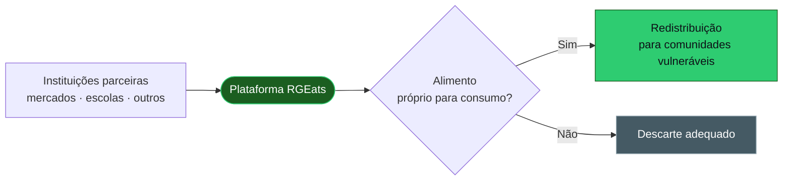

<div align="center">


<!-- Coloque aqui a logo do projeto, ex.:  -->

<a href="https://git.io/typing-svg">
  
</a>

<br/>


<br/>

**[O Problema](#-o-problema) · [A Solução](#-a-solução) · [Jornada](#-a-jornada-do-projeto) · [Stack](#-stack-tecnológica) · [Arquitetura](#-estrutura-do-repositório) · [Rodando](#-rodando-localmente) · [Equipe](#-a-equipe)**

</div>

<br/>

---

## Sobre o projeto

O **RGEats** é o Trabalho de Conclusão de Curso (TCC) do curso técnico em **Informática para a Internet** da **ETEC de Rio Grande da Serra**.

Ao longo do curso, reunimos tudo o que aprendemos, e usamos sessões de brainstorm em sala de aula para identificar um problema que se repete no nosso município: **a fome, e a falta de recursos para combatê-la**. A pergunta que guiou o grupo foi simples:

> *Será que a informática pode ajudar a resolver isso?*

A resposta virou uma **plataforma web capaz de acompanhar o desperdício de alimentos em Rio Grande da Serra e encontrar um novo destino para eles antes que sejam descartados.**

---

## O Problema

Rio Grande da Serra tem uma **grande lacuna socioeconômica na questão alimentar**. Diversas regiões do município vivem em situação de marginalização e, ao mesmo tempo, a **falta de verbas** limita as soluções disponíveis.

<table>
<tr>
<td width="50%" valign="top">

### De um lado
Mercados, escolas e outras instituições movimentam alimentos todos os dias, e parte deles acaba descartada.

</td>
<td width="50%" valign="top">

### Do outro
Comunidades vulneráveis sem acesso regular a alimentação, em um município com poucos recursos para mudar esse cenário.

</td>
</tr>
</table>

**O RGEats existe para conectar essas duas pontas.**

---

## A Solução

Uma aplicação web capaz de **reduzir o desperdício alimentar** e **redirecionar esses alimentos para consumo seguro** nas comunidades mais vulneráveis do município.



>  Diagrama simplificado. Os fluxos completos (chegada dos alimentos, destinos, descarte e redistribuição) foram modelados no **Draw.io** durante a fase de prototipagem.

---

##  A Jornada do Projeto

| Fase | Etapa | O que foi feito | Status |
|:---:|---|---|:---:|
| **01** | **Concepção e Ideação** | Brainstorming, delimitação do problema e levantamento de requisitos. **Figma** para estruturar o site e **Draw.io** para fluxogramas e lógica. | ✅ Concluída |
| **02** | **Pesquisa de Campo e Mapeamento** | Coleta de dados quantitativos com **Google Forms** e contato com atores locais. | ✅ Concluída |
| **03** | **Prototipagem e Modelagem** | Wireframes (**Figma**), Diagrama Entidade-Relacionamento (**Draw.io**) e fluxos de tela. | ✅ Concluída |
| **04** | **Desenvolvimento e Integração** | Front-end, back-end em **PHP** e banco de dados **MySQL**, com auxílio de IA. | ✅ Concluída |
| **05** | **Testes, Refinamento e Defesa** | Homologação das funcionalidades, ajustes de Pré-TCC e apresentação final. | 🚧 Pendente |

```text
Progresso  ████████████████░░░░  4 de 5 fases concluídas
```

###  Como mapeamos a realidade

Para saber **onde** a vulnerabilidade é maior, lançamos um **questionário no Google Forms** e buscamos números concretos. Em paralelo, procuramos **cooperação com instituições locais** que movimentam alimentos, principalmente mercados e escolas.

---

##  Stack Tecnológica

<div align="center">


</div>

###  Prototipagem

| Ferramenta | Como foi usada |
|---|---|
| **Figma** | Construção do layout e alinhamento de expectativas sobre o design. Foi usado extensivamente para poupar tempo na hora de codar HTML e CSS. A versão final recebeu muitas alterações em relação ao primeiro protótipo. |
| **Draw.io** | Estruturação da lógica do projeto: o fluxo dos alimentos desde a chegada até seus destinos e locais de descarte, e um segundo fluxo para a redistribuição alimentar. |
| **Gemini** | Criação artística da logo e das camisetas da equipe. |

<!-- Adicione aqui o primeiro protótipo:
<div align="center"><br/><sub>O primeiro protótipo, antes das mudanças da versão final</sub></div>
-->

###  Desenvolvimento

O desenvolvimento se divide em três frentes: **front-end** (interface e interação), **back-end** (lógica de negócio e armazenamento de dados) e **ferramentas auxiliares** (servidor, GitHub etc.), que garantiram o ambiente de testes, o versionamento seguro e o deploy.

<details>
<summary><b> Front-end</b> — HTML5 · CSS3 · JavaScript</summary>

<br/>

#### HTML5 · *conduzido por Raphael*
Estrutura toda a semântica das páginas para que o conteúdo seja **acessível, bem organizado e otimizado** para os navegadores. É o esqueleto da plataforma: formulários, links de navegação e blocos de informação sobre o projeto.

```text
TCC/Site/public/
├── Contato.HTML
├── Mapa.HTML
├── PaginaInicial.HTML
├── Parceiros.HTML
└── sobrenos.HTML
```

#### CSS3 · *conduzido por Ryan*
Cuida das cores e da identidade visual, da **responsividade** (celular e desktop) e das regras de **acessibilidade visual**.

```text
TCC/Site/public/CSS/
├── acessibilidade.css
└── style.css
```

#### JavaScript · *conduzido por Gustavo*
Anima o site e implementa funcionalidades do lado do cliente: **mapas interativos**, **carrosséis de imagens** e **botões de acessibilidade** que alteram o comportamento visual da página em tempo real.

```text
TCC/Site/public/JS/
├── acessibilidade.js
├── animacao_bolha.js
├── carrossel.js
└── mapa_escolas.js
```

</details>

<details>
<summary><b> Back-end</b> — PHP · MySQL</summary>

<br/>

#### MySQL · *conduzido por José*
O coração do banco de dados relacional. Guarda os **cadastros de usuários**, os **registros das entidades parceiras** e o **controle do fluxo dos alimentos** que serão redirecionados, garantindo a persistência das informações a longo prazo.

```text
TCC/Site/banco_de_dados/
└── Esqueleto_prototipo_basico.sql
```

#### PHP · *conduzido por Thiago*
Processa as requisições no servidor antes de devolver a interface pronta. Faz a ponte com o banco de dados, cria as rotas das páginas e cuida de funções centrais como **login** e **registro de usuários**.

```text
TCC/Site/public/
├── Navbar.php
├── acessibilidade.php
├── contato.php
├── index.php
├── parceiros.php
├── perfil.php
├── registrar.php
├── rodape.php
├── sobrenos.php
└── tela_login.php

TCC/Site/conexao/
├── conexao.php
└── logout.php
```

</details>

<details>
<summary><b> Ferramentas auxiliares</b> — XAMPP · FileZilla · Git/GitHub · VS Code · Brackets</summary>

<br/>

| Ferramenta | Papel no projeto |
|---|---|
| **XAMPP** | Testes locais do servidor. Simulou o ambiente web no computador (Apache + MySQL), permitindo rodar o PHP sem hospedar o site nas fases iniciais. |
| **FileZilla** | Cliente FTP usado para enviar os arquivos locais à hospedagem remota, mantendo o site online sempre com a versão mais recente do código. |
| **Git** | Controle de versão: rastrear cada alteração e reverter erros quando necessário. |
| **GitHub** | Repositório remoto que unificou o trabalho em equipe, com todos os membros colaborando nos mesmos arquivos. |
| **VS Code** | IDE principal, usada para os scripts de front-end e back-end. |
| **Brackets** | IDE usada em momentos específicos, pela leveza e pela facilidade de visualizar edições de design web. |

</details>

---

##  Transparência no uso de IA

Usamos inteligência artificial como **apoio**, e queremos deixar claro onde e como:

| IA | Papel no projeto |
|:---:|---|
| **ChatGPT** | Idealização inicial: sessões de brainstorming, lapidação da ideia de combate ao desperdício e planejamento das tecnologias. |
| **Gemini** | Documentação, criação do design das camisetas e da logo, e apoio na redação de textos mais claros para as entregas acadêmicas. |
| **Claude** | Criação geral de scripts: sugestão de correções lógicas, ajuda para entender pequenos problemas no PHP e otimização da estrutura do código. |

---

## 📂 Estrutura do repositório

```text
TCC/
└── Site/
    ├── banco_de_dados/
    │   └── Esqueleto_prototipo_basico.sql
    ├── conexao/
    │   ├── conexao.php
    │   └── logout.php
    └── public/
        ├── *.php              → rotas e lógica (login, registro, perfil, parceiros...)
        ├── *.HTML             → páginas estáticas
        ├── CSS/               → style.css · acessibilidade.css
        └── JS/                → carrossel · mapa · animações · acessibilidade
```

---

## Rodando localmente

> ⚠️ Passo a passo de referência. Ajuste caminhos e credenciais conforme o seu ambiente.

**Pré-requisito:** [XAMPP](https://www.apachefriends.org/) instalado.

```bash
# 1. Clone o repositório dentro da pasta htdocs do XAMPP
git clone https://github.com/SEU-USUARIO/SEU-REPOSITORIO.git
```

1. Abra o **XAMPP Control Panel** e inicie o **Apache** e o **MySQL**.
2. Acesse o **phpMyAdmin** (`http://localhost/phpmyadmin`), crie o banco e importe o arquivo `TCC/Site/banco_de_dados/Esqueleto_prototipo_basico.sql`.
3. Confira em `TCC/Site/conexao/conexao.php` se host, usuário, senha e nome do banco batem com o seu ambiente.
4. Abra no navegador o caminho do projeto dentro do `localhost` (por exemplo, `http://localhost/TCC/Site/public/`).

---

## A Equipe

<div align="center">

<table>
<tr>
<td align="center" width="200"><br/><b>José Vitor<br/>dos Santos Pereira</b><br/><sub> Banco de dados (MySQL)</sub><br/><br/></td>
<td align="center" width="200"><br/><b>Thiago<br/>Siqueira Russo</b><br/><sub> Back-end (PHP)</sub><br/><br/></td>
<td align="center" width="200"><br/><b>Raphael<br/>Pierre Lima da Silva</b><br/><sub> Estrutura (HTML)</sub><br/><br/></td>
</tr>
<tr>
<td align="center" width="200"><br/><b>Gustavo<br/>Alves dos Santos</b><br/><sub> Interatividade (JavaScript)</sub><br/><br/></td>
<td align="center" width="200"><br/><b>Ryan<br/>Rodrigues Gonçalves</b><br/><sub> Estilo e acessibilidade (CSS)</sub><br/><br/></td>
<td align="center" width="200"><br/><b>Orientador</b><br/>José Victor Moreira<br/>da Silva dos Santos<br/><br/></td>
</tr>
</table>

</div>

> Todos os integrantes participaram do planejamento, das sessões de brainstorm e da construção do projeto. Os papéis acima indicam quem **conduziu** cada frente no código.

---

## Status e próximos passos

- [x] Concepção, ideação e levantamento de requisitos
- [x] Pesquisa de campo e mapeamento
- [x] Wireframes, DER e fluxos de tela
- [x] Desenvolvimento do front-end, back-end e banco de dados
- [ ] Homologação das funcionalidades
- [ ] Ajustes de Pré-TCC
- [ ] Apresentação final e defesa

---

<div align="center">

### Porque desperdício de comida não combina com fome.

<sub>Feito com dedicação pelo grupo RGEats · ETEC de Rio Grande da Serra · Informática para a Internet</sub>


</div>
